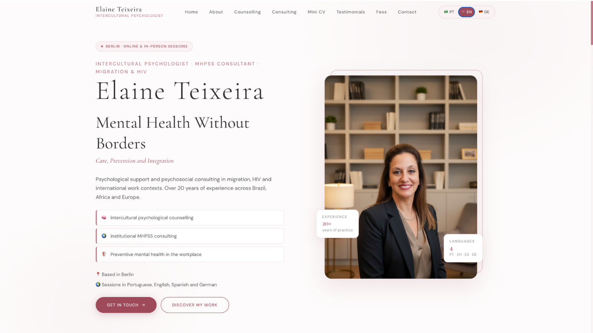

# Elaine Teixeira — Psicóloga Intercultural

<p align="center">
  
</p>

Website institucional profissional com React + Vite + TypeScript + Tailwind CSS.

## Stack

| Tecnologia     | Uso                              |
|---------------|----------------------------------|
| React 18      | UI library                       |
| Vite 5        | Build tool & dev server          |
| TypeScript    | Type safety                      |
| Tailwind CSS  | Utility-first styling            |
| react-i18next | Internacionalização (PT, EN, DE) |
| Framer Motion | Animações elegantes              |
| lucide-react  | Ícones                           |

## Estrutura

```
src/
├── assets/               # Imagens (substituir therapist-placeholder.jpg)
├── components/
│   ├── layout/           # Header, Footer
│   ├── ui/               # Button, SectionTitle, Card  (reutilizáveis)
│   └── sections/         # Hero, About, Counselling, Consulting,
│                         # MiniCV, Testimonials, Prices, Contact
├── hooks/
│   └── useScrollReveal.ts
├── i18n/
│   ├── i18n.ts           # Configuração i18next
│   ├── pt.json           # Português
│   ├── en.json           # English
│   └── de.json           # Deutsch
├── pages/
│   └── Home.tsx          # Página principal
├── styles/
│   └── globals.css       # Design tokens + base styles
├── App.tsx
└── main.tsx
```

## Como rodar

### Pré-requisitos
- Node.js 18+
- npm ou pnpm

### Instalação

```bash
# 1. Instalar dependências
npm install

# 2. Iniciar servidor de desenvolvimento
npm run dev

# 3. Abrir no navegador
# http://localhost:5173
```

### Build para produção

```bash
npm run build
npm run preview
```

## Trocar foto da terapeuta

Substitua o arquivo:
```
src/assets/therapist-placeholder.jpg
```

No componente `TherapistPortrait.tsx`, troque o SVG por:

```tsx
import photo from '@/assets/therapist-photo.jpg'

export function TherapistPortrait() {
  return (
    
  )
}
```

## Personalização

### Cores
Edite as variáveis em `src/styles/globals.css`:
```css
:root {
  --rose-deep:  #9F4A5A;
  --rose-mid:   #C07A86;
  --rose-light: #E8C4CB;
  --rose-wash:  #FAF2F3;
}
```

### Textos
Edite os arquivos JSON em `src/i18n/`:
- `pt.json` — Português
- `en.json` — English
- `de.json` — Deutsch

### Adicionar novo idioma
1. Crie `src/i18n/xx.json`
2. Importe e registre em `src/i18n/i18n.ts`
3. Adicione ao array `LANGUAGES`

## Formulário de contato

Por padrão, o formulário exibe uma confirmação visual.
Para integrar com email, adicione um serviço como:
- **Resend** + API Route
- **Formspree** (substitua o `handleSubmit`)
- **EmailJS**

---

© 2024 Elaine Teixeira
